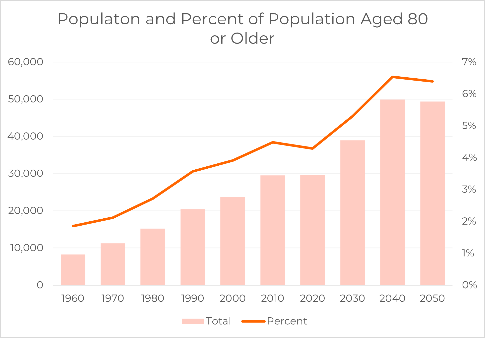

```{r setup, echo=FALSE, message=FALSE, warning=FALSE}
#install.packages('showtext', dependencies = TRUE) #for montserrat font in ggplot

library(showtext)
library(glptools)
library(readxl)
glp_load_packages(T)

font_add_google("Montserrat", "Montserrat")
knitr::opts_chunk$set(echo = FALSE, warning = FALSE, message = FALSE, cache = FALSE,  
                      dev.args=list(bg="transparent"), fig.width=9, fig.height=6) 

```

```{r clean_data}
library(writexl)
lou_projections <- read_excel("C:/Users/morga/OneDrive - The Community Foundation of Louisville, Inc/data/Population-Projections-by-Sex-and-Five-Year-Age-Group.xlsx")

proj_65_plus <- lou_projections %>% 
  filter(FIPS == '21111') %>%
  select(AGEGRP, MALE, N2025, N2030, N2035, N2040, N2045, N2050) %>%
  #sum male/female for age group totals
  group_by(AGEGRP) %>%
  summarise(across(c(N2025, N2030, N2035, N2040, N2045, N2050), ~ sum(.x, na.rm = TRUE))) %>%
  ungroup() 
  # write_xlsx("interim_data/proj_65_plus.xlsx")
```

```{r}

lou3 <- read_excel("interim_data/lou_projections.xlsx")

proj_65_plus <- lou3 %>%
  select(year, percent_over_65, pop_total)%>%
  drop_na() %>%
  rename(Year = year, Percent = percent_over_65, Total = pop_total)

proj_80_plus <- lou3 %>%
  select(year, percent_over_80, pop_total) %>%
  rename(Year = year, Percent = percent_over_80, Total = pop_total) %>%
  drop_na()

census_1960_2020 <- read_excel("interim_data/census_sexage_1960-2020.xlsx")

census_1960_2020 %<>% 
  select(Year, Total_Pop, Total_65, over_80, percent_80, percent_65) %<>%
  drop_na()

census_over_65 <- census_1960_2020 %>%
  select(Year, percent_65, Total_Pop) %>%
  rename(Percent = percent_65, Total = Total_Pop)

census_over_80 <- census_1960_2020 %>%
  select(Year, percent_80, Total_Pop) %>%
  rename(Percent = percent_80, Total = Total_Pop)
```

```{r append_ACS_projections}
# proj_80_plus %<>%
#   select(year, percent) %<>%
#   rename(Year = year, Percent = percent)

proj_65_plus2 <- proj_65_plus %>%
  filter(Year%%2 == 0)

combined2 <- bind_rows(census_over_65, proj_65_plus)%>%
  drop_na()

proj_80_plus2 <- proj_80_plus %>%
  
  filter(Year%%2 == 0)

combined_80_census <- bind_rows(census_over_80, proj_80_plus)

plot_65_over_proj2 <- ggplot(combined2, aes(x = Year, y = Percent)) +
  geom_line(size = 1.2, color = "#FFCCC2") +                      
  geom_point(size = 2, color = "#f60") + #points on the year (optional)                      
  labs(
    title = "Percent of Population Aged 65 or Older",
    x = NULL,
    y = "Percent of Population"
  ) +
  theme_minimal(base_family = "Montserrat", base_size = 22) +
  scale_x_continuous(
    breaks = seq(min(combined2$Year), max(combined2$Year), by = 10),  #every other year
    ) +
  theme(
    axis.text.x = element_text(angle = 45, hjust = 1, family = "Montserrat"),
    plot.title = element_text(face = "bold", size = 26, family = "Montserrat"),
    legend.position = "top"
  )
print(plot_65_over_proj2)

plot_80_over_proj2 <- ggplot(combined_80_census, aes(x = Year, y = Percent)) +
  geom_line(size = 1.2, color = "#FFCCC2") +                      
  geom_point(size = 2, color = "#f60") + #points on the year (optional)                      
  labs(
    title = "Percent of Population Aged 80 or Older",
    x = NULL,
    y = "Percent of Population"
  ) +
  theme_minimal(base_family = "Montserrat", base_size = 22) +
  scale_x_continuous(
    breaks = seq(min(combined_80_census$Year), max(combined_80_census$Year), by = 10),  
    ) +
  theme(
    axis.text.x = element_text(angle = 45, hjust = 1, family = "Montserrat"),
    plot.title = element_text(face = "bold", size = 26, family = "Montserrat"),
    legend.position = "top"
  )
print(plot_80_over_proj2)
```



