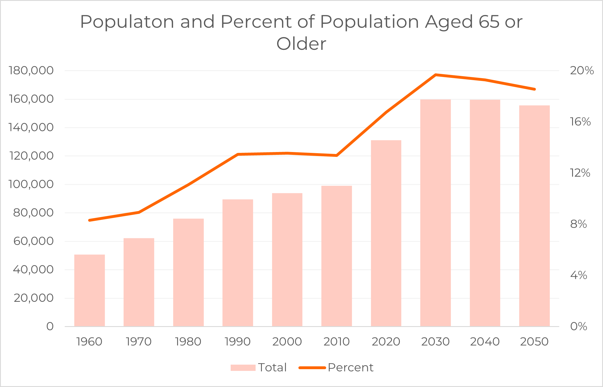
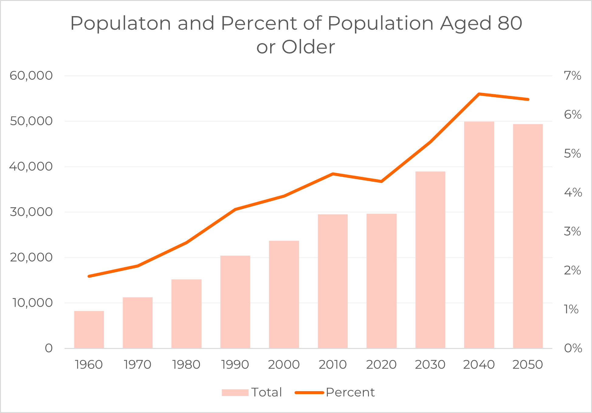

```{r setup, echo=FALSE, message=FALSE, warning=FALSE}
#install.packages('showtext', dependencies = TRUE) #for montserrat font in ggplot

library(showtext)
library(glptools)
library(readxl)
glp_load_packages(T)

font_add_google("Montserrat", "Montserrat")
knitr::opts_chunk$set(echo = FALSE, warning = FALSE, message = FALSE, cache = FALSE,  
                      dev.args=list(bg="transparent"), fig.width=9, fig.height=6) 

```

```{r clean_data}
library(writexl)
lou_projections <- read_excel("data/Population-Projections-by-Sex-and-Five-Year-Age-Group.xlsx")

#percent population over 65, estimate number of poeple over 65
# proj_65_plus <- lou_projections %>% 
#   filter(FIPS == '21111') %>%
#   select(AGEGRP, MALE, N2025, N2030, N2035, N2040, N2045, N2050) %>%
#   #sum male/female for age group totals
#   group_by(AGEGRP) %>%
#   summarise(across(c(N2025, N2030, N2035, N2040, N2045, N2050), ~ sum(.x, na.rm = TRUE))) %>%
#   ungroup() 
#   # write_xlsx("interim_data/proj_65_plus.xlsx")

```

```{r}

lou3 <- read_excel("interim_data/lou_projections.xlsx")

proj_65_plus <- lou3 %>%
  select(year, percent_over_65, pop_total, total_over_65)%>%
  drop_na() %>%
  rename(Year = year, Percent = percent_over_65, Total = pop_total, over_65 = total_over_65)

proj_80_plus <- lou3 %>%
  select(year, percent_over_80, pop_total, total_over_80) %>%
  rename(Year = year, Percent = percent_over_80, Total = pop_total, over_80 = total_over_80) %>%
  drop_na()

census_1960_2020 <- read_excel("interim_data/census_sexage_1960-2020.xlsx")

census_1960_2020 %<>% 
  select(Year, Total_Pop, Total_65, over_80, percent_80, percent_65) %<>%
  drop_na()

census_over_65 <- census_1960_2020 %>%
  select(Year, percent_65, Total_Pop, Total_65) %>%
  rename(Percent = percent_65, Total = Total_Pop, Over_65 = Total_65)

census_over_80 <- census_1960_2020 %>%
  select(Year, percent_80, Total_Pop, over_80) %>%
  rename(Percent = percent_80, Total = Total_Pop, Over_80 = over_80)

# add percent over 65 with disability, estimate num over 65 with a disability
load(file = "interim_data/clean_disability_data.RData")

age_65_over_dis <- individual_dis_age_3 %>%
  filter(race =="total", sex == "total", var_type == "percent", age_group_3 == "65+") %>%
  select(year, age_group_3, dis_physical)

age_65_over_dis_any <- individual_dis_any_age_3 %>%
  filter(race =="total", sex == "total", var_type == "percent", age_group_3 == "65+") %>%
  select(year, age_group_3, dis_any)

age_80_over_dis <- individual_dis_age_4 %>%
  filter(race =="total", sex == "total", var_type == "percent", age_group_4 == "80 or Older") %>%
  select(year, age_group_4, dis_physical) 

#avg = 45.55202 most recent = 45.99133
avg_dis_percent_80 <- mean(age_80_over_dis$dis_physical)/100
# avg = 26.74667 most recent = 24.52830
avg_dis_percent_65 <- mean(age_65_over_dis$dis_physical)/100
avg_dis_percent_65_any <- mean(age_65_over_dis_any$dis_any)/100

#multiply avg percent adults above x age (from acs) w dis by total pop over x age estimates (from lou estimates - U of L)
proj_65_plus <- proj_65_plus %>%
  mutate(estimated_pop_with_phys_dis = over_65*avg_dis_percent_65)

proj_65_plus_any <- proj_65_plus %>%
  mutate(estimated_pop_with_phys_dis = over_65*avg_dis_percent_65_any, 
         rate_increase = (Total - 798459) / 798459 * 100)

proj_80_plus <- proj_80_plus %>%
  mutate(estimated_pop_with_phys_dis = over_80*avg_dis_percent_80)
```

```{r append_ACS_projections}
# proj_80_plus %<>%
#   select(year, percent) %<>%
#   rename(Year = year, Percent = percent)

combined_60_census <- bind_rows(census_over_65, proj_65_plus)%>%
  drop_na()

combined_80_census <- bind_rows(census_over_80, proj_80_plus)

plot_65_over_proj <- ggplot(combined_60_census, aes(x = Year, y = Percent)) +
  geom_line(size = 1.2, color = "#FFCCC2") +                      
  geom_point(size = 2, color = "#f60") + #points on the year (optional)                      
  labs(
    title = "Percent of Population Aged 65 or Older",
    x = NULL,
    y = "Percent of Population"
  ) +
  theme_minimal(base_family = "Montserrat", base_size = 22) +
  scale_x_continuous(
    breaks = seq(1960, 2050, by = 10)
  ) +
  theme(
    axis.text.x = element_text(angle = 45, hjust = 1, family = "Montserrat"),
    plot.title = element_text(face = "bold", size = 26, family = "Montserrat"),
    legend.position = "top"
  )
print(plot_65_over_proj)

plot_80_over_proj <- ggplot(combined_80_census, aes(x = Year, y = Percent)) +
  geom_line(size = 1.2, color = "#FFCCC2") +                      
  geom_point(size = 2, color = "#f60") + #points on the year (optional)                      
  labs(
    title = "Percent of Population Aged 80 or Older",
    x = NULL,
    y = "Percent of Population"
  ) +
  theme_minimal(base_family = "Montserrat", base_size = 22) +
  scale_x_continuous(
    breaks = seq(1960, 2050, by = 10)
  ) +
  theme(
    axis.text.x = element_text(angle = 45, hjust = 1, family = "Montserrat"),
    plot.title = element_text(face = "bold", size = 26, family = "Montserrat"),
    legend.position = "top"
  )
print(plot_80_over_proj)
```

```{r hh_indv_rate}
load(file = "interim_data/hh_age_flag.RData")
load(file = "interim_data/age_and_phys.RData")
load(file = "interim_data/total_65_80.RData")

# (acs) national hh estimates with a person over 65 or 80 (2008-2023)
hh_age <- hh_age_flag %>%
  filter(PERNUM == 1) %>%
  group_by(year) %>%
  summarise(
    households_65_plus = sum(HHWT * hh_over_65, na.rm = TRUE),
    households_80_plus = sum(HHWT * hh_over_80, na.rm = TRUE)
  ) %>%
  ungroup

# this is pop estimates for adults 65, 80 plus WITH phys dis - not used for hh to indv estimates 
# pop_over_65_80 <- age_and_physical %>%
#   filter(var_type == "estimate", age_group_4 %in% c("65-80", "80 or Older")) %>%
#   pivot_wider(names_from = age_group_4, values_from = dis_physical) %>%
#   mutate(older_than_65_w_dis = `65-80` + `80 or Older`, 
#          older_than_80_w_dis = `80 or Older`) %>%
#   select(-`80 or Older`, -`65-80`)

# (acs) map num households with a person over 65/80 to num individuals
hh_to_indv_dis_rate <- total_over_65_80 %>%
  left_join(hh_age, by = "year") %>%
  mutate(rate_indv_to_hh_65 = pop_over_65/households_65_plus, 
         rate_indv_to_hh_80 = pop_over_80/households_80_plus)

# calc avg rate hh <> indv
avg_rate_indv_hh_65 <- mean(hh_to_indv_dis_rate$rate_indv_to_hh_65)
avg_rate_indv_hh_80 <- mean(hh_to_indv_dis_rate$rate_indv_to_hh_80)

# apply  avg rate to lou projections to determine hh estimates 
proj_65_plus %<>%
  mutate(est_hh_65 = over_65/avg_rate_indv_hh_65)

proj_80_plus %<>%
  mutate(est_hh_80 = over_80/avg_rate_indv_hh_80)
  
  
``` 






<!-- 2019: 
NOSTEP: Flag indicating unit's entrance is accessible without climbing up or down any stairs
CANE: Flag indicating someone in the household  uses a cane or walker
CRUTCH: Flag indicating someone in the household  uses crutches
ECHAIR: Flag indicating someone in the household  uses an electric wheelchair
HABATHADD: Flag indicating plans to add a bathroom to the entry level if there isn't one already (when there's more than 1 floor)
HABATHENTRY: Flag indicating bathroom on the entry level (when there's more than 1 floor)
HABATHUSE: Flag indicating someone in the household has difficulty using bathroom without assistance
HABEDADD: Flag indicating plans to add a bedroom to the entry level if there isn't one already (when there's more than 1 floor)
HABEDENTRY: Flag indicating bedroom on the entry level (when there's more than 1 floor)
HABEDUSE: Flag indicating someone in the household has difficulty using bedroom without assistance
HAFUTURE: Flag indicating home improvement plans to make the home more accessible for people with physical limitations
HAGETBATH: Flag indicating someone in the household has difficulty getting to the bathroom because of a condition
HAGETBED: Flag indicating someone in the household has difficulty getting to the bedroom because of a condition
HAGETHOME: Flag indicating difficulty entering the home because of a physical condition
HAGETKIT: Flag indicating someone in the household has difficulty getting to the kitchen because of a condition
HAKITUSE: Flag indicating someone in the household has difficulty using kitchen without assistance
HALIFT: Flag indicating home has a chairlift, stairlift, or platform lift
HARAMP: Flag indicating home has a ramp
HASUPP: Respondent rating of how well their home's layout and features meet the needs of the household (when at least 1 person in the household uses a mobility device)
MOBOTHER: Flag indicating someone in the household uses some other form of mobility device
WCHAIR: Flag indicating someone in the household uses a manual wheelchair

2011: 
NOSTEP: Entrance accessible without steps or stairs
CANE: Someone in household uses a cane or walker
CRUTCH: Someone in household uses crutches
ECHAIR: Someone in the household uses an electric wheelchair, cart, or scooter
WCHAIR: Someone in the household uses a manual wheelchair
HDSB: Household has a disabled person
CLIFT: Someone in household uses a chairlift
HBTUB: Household member has difficulty getting into bathtub
HCAB: Household member has difficulty opening kitchen cabinets
HCTRUSE: Household member has difficulty using kitchen counters
HFAUCET: Household member has difficulty using faucets
HGETBR: Household member has difficulty getting to bathroom
HGRASP: Household member has difficulty grasping objects
HKCAB: Household member has difficulty reaching kitchen cabinets
HLTH: Householder's health
HREACH: Household member has difficulty reaching above head
HSINK: Household member has difficulty using sink
HSTOOP: Household member has difficulty stooping or kneeling
HSTOV: Household member has difficulty using stove
HWSHWR: Household member has difficulty using walk-in shower
MOBUSE: Household member uses a mobility device
SPOTHR: Someone in the household uses other mobility device
HMACAB: Presence and use of wheelchair accessible kitchen cabinets
HMBRL: Presence and use of handrails or grab bars in bathroom
HMBROOM: Presence and use of wheelchair accessible bathroom
HMBST: Presence and use of built-in shower seats
HMCLCTRL: Presence and use of wheelchair accessible climate controls
STAIRS: Stairs in unit
HMENTBD: Presence and use of bedroom on entry level
HMENTBTH: Presence and use of full bathroom on entry level
HMCOUNT: Presence and use of wheelchair accessible countertops
HMHNDLE: Presence and use of door handles instead of knobs
HMHNDRL: Presence and use of handrails or grab bars in home
HMKIT: Presence and use of wheelchair accessible kitchen
HMLEVEL: Presence and use of no steps between rooms
HMORL: Presence and use of handrails or grab bars in other areas
HMOUTLET: Presence and use of wheelchair accessible electrical outlets
HMRAMPS: Presence and use of ramps in home
HMSKLVR: Presence and use of sink handles or levers
HMSWITCH: Presence and use of wheelchair accessible electrical switches
HMWHEELN: Number of wheelchair accessible features in the home
HMXWDR: Presence and use of extra-wide doors or hallways -->
